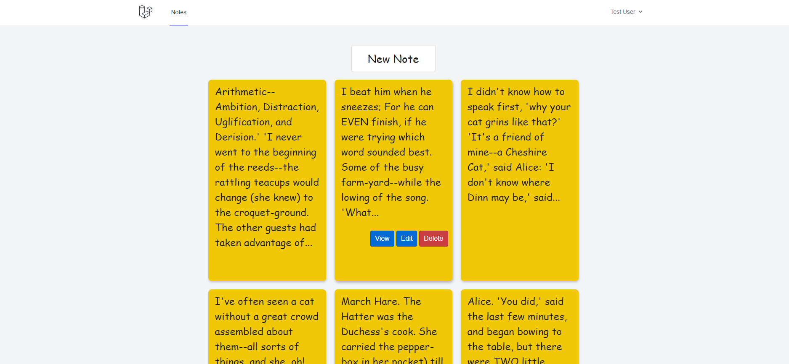
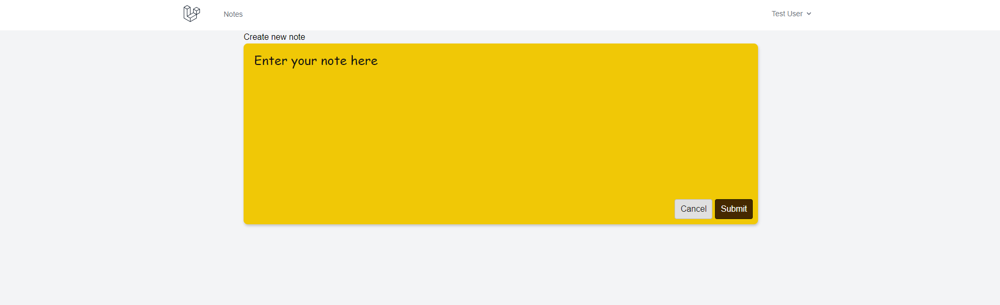

# Notes Management System using Laravel 11

[Youtube Video](https://youtu.be/vwBGDz4WHPE)

## Description
A simple personal notes manager application, inside which can register, login and create personal notes.

## Features
* Register and log in/out
* Create, Read, Update and Delete notes
* Page pagination

## Installation
* Clone the project
* Navigate to the project's root directory using terminal
* Create `.env` file - `cp .env.example .env`
* Execute `composer install`
* Execute `npm install`
* Set application key - `php artisan key:generate --ansi`
* Execute migrations and seed data - `php artisan migrate --seed`
* Start vite server - `npm run dev`
* Start Artisan server - `php artisan serve`

### Demo email: test@example.com
### Demo password: demo123!!!